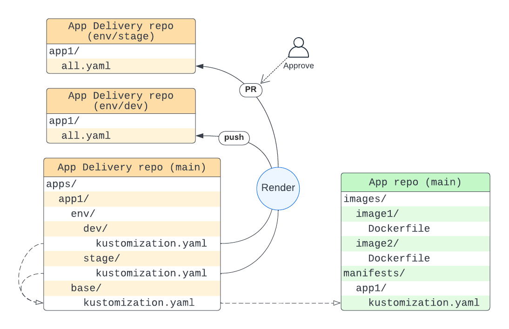

# Example application delivery repository

## Repo structure

This repository contains kustomization files for every environment of every appplication from [nikita-akuity/demo-workflow](https://github.com/nikita-akuity/demo-workflow), and some automation implementing rendered environment branches gitops model.

### Folders

* `apps/<app_name>/base`  
  should contain a `kustomization.yaml` file with resourse list, first element of the list should point to the application repo
* `apps/<app_name>/env/<env_name>`  
  should contain a `kustomization.yaml` file pointing to base folder, and some environment-specific configuration

### Branches

* `env/<env_name>`  
  an orphan branch, containig **only** results of `kustomize build` run, placed into `<app_name>` folders
* `deploy-pr/<app_name>/env/<env_name>`  
  temporary branch to make pull requests from. Need for deploying into stage or prod environment

# Applications in this repo
Please check the corresponding links to learn details about environment requirements for the applications:
* [single-workflow](apps/single-workflow)
* [many-workflows](apps/many-workflows)
